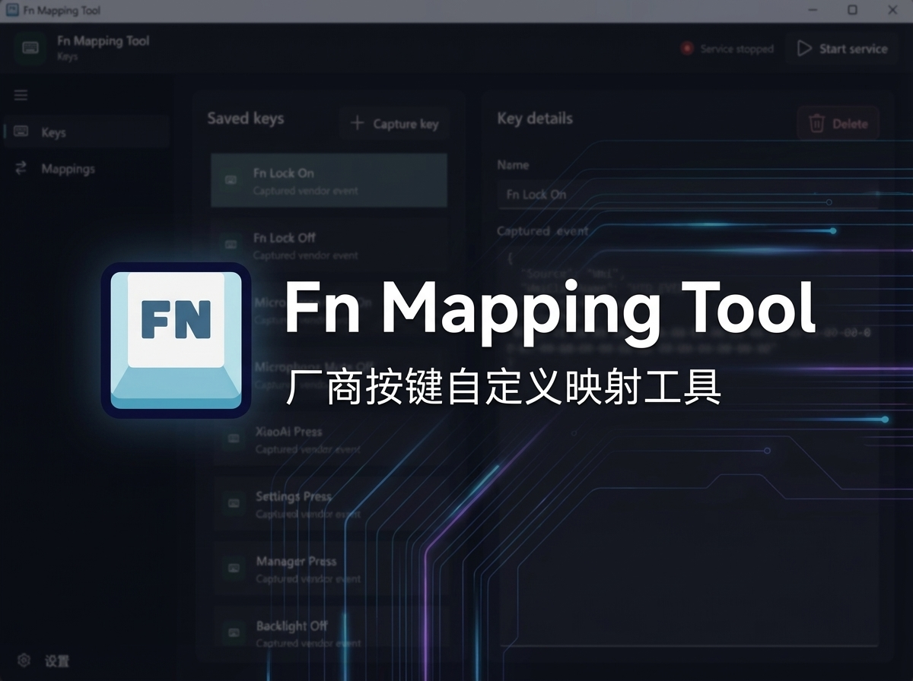

# Fn Mapping Tool

[中文说明](#中文说明) | [English](#english)




## 中文说明

### ✨ 这是什么

Fn Mapping Tool 是一个给 Windows 笔记本用的 OEM / 厂商特殊按键映射工具。

我做这个项目，主要是因为小米电脑自带的电脑管家不太好用：可定制性不高，而且卸载以后，一些特殊按键会直接失效。对我这台机器来说，最明显的就是：

- 🎤 麦克风静音键
- 🖥️ 电脑管家键
- 🤖 小爱键

所以我干脆自己写了这个工具，把这些键重新接回来，也顺手把它做成了一个更通用的方案，方便别的机器做适配。

它的实现方式也比较直接：后台监听 OEM 通过 WMI 抛出的事件，再把这些事件转换成应用里可配置的 Key，最后按你的映射去执行动作。并不是所有机器都会通过 WMI 暴露这些事件，所以兼容性取决于厂商自己的实现。

### 🚀 现在能做什么

- 捕获 OEM / WMI 特殊按键事件
- 保存按键定义（Keys）
- 给按键配置映射（Mappings）
- 执行设置、投屏、音量、媒体控制、亮度、启动应用等动作
- 显示 OSD
- 由后台 Worker 常驻处理按键事件

### 🧪 测试范围

> 目前只在 **Xiaomi Book Pro 14 2026 + Windows 11** 上实际测试过。

如果你在别的机器上跑通了，欢迎提交 preset 😄

### 🧩 运行结构

- **Controller**：WinUI 3 桌面界面，用来编辑配置和控制后台服务
- **Worker**：后台进程，负责监听 OEM 事件并执行动作

普通用户实际需要打开的是 **Controller**。

### 📦 Preset

仓库内置的 preset 在：

- `assets/config/`

例如：

- `assets/config/xiaomibookpro14 2026.json`

应用启动后，这些 preset 会同步到：

- `%LocalAppData%\FnMappingTool\presets`

你可以在 **Settings > Files** 里打开 preset 文件夹、复制自己的 preset、刷新列表并直接加载。

如果你想给别的机器做适配，也欢迎把 preset 提交回来。文件名最好写清楚机型，比如 `brand-model-year.json`，再顺手说明一下机器型号、系统版本，以及已经适配了哪些键，这样别人更容易直接用上 👍

### 🛠️ 运行时要求

默认构建产物是 **framework-dependent**，体积更小。

目标电脑如果没装运行时，需要先安装：

- **.NET 8 Desktop Runtime x64**
- **Windows App Runtime x64（建议 1.7 或更新）**

如果你想打一个更接近“拷过去就能跑”的包：

```powershell
.\build.ps1 -SelfContained
```

### 🔨 构建

默认构建：

```powershell
.\build.ps1
```

可选参数：

```powershell
.\build.ps1 -Version 0.1.0
.\build.ps1 -SkipZip
.\build.ps1 -SkipMsi
.\build.ps1 -SelfContained
```

输出文件：

- `artifacts/FnMappingTool-portable-v<version>.zip`
- `artifacts/FnMappingTool-setup-v<version>.msi`

### 🗂️ 项目结构

- `src/FnMappingTool.Controller/` — WinUI 3 控制器
- `src/FnMappingTool.Worker/` — 后台 Worker
- `src/FnMappingTool.Core/` — 共享模型、服务、IPC
- `src/FnMappingTool.Setup/` — WiX 安装包工程
- `assets/` — 应用资源和 preset
- `build/` — 中间产物
- `artifacts/` — 最终发布产物

### 🎨 图标来源

应用的 icon 图来自：

- https://www.flaticon.com

### 📄 作者与协议

- 作者：https://github.com/leehyukshuai
- 仓库：https://github.com/leehyukshuai/Fn-Mapping-Tool
- 协议：**GPL-3.0**（见 `LICENSE`）

---

## English

### ✨ What this is

Fn Mapping Tool is a Windows utility for remapping OEM / vendor-specific keys.

I originally made it because Xiaomi PC Manager was not a great fit for this. It is not very customizable, and once uninstalled, some special keys stop working entirely. On my machine, the most obvious ones were:

- 🎤 microphone mute
- 🖥️ the PC Manager key
- 🤖 the XiaoAi key

So I built this tool to bring those keys back, then turned it into something more general so other laptops can be adapted too.

The implementation is fairly simple: the background worker listens for OEM events exposed through WMI, turns those events into configurable Keys in the app, and then runs whatever action you mapped to them. Not every machine exposes these events through WMI, so compatibility depends on the vendor's implementation.


### 🚀 What it does

- captures OEM / WMI key events
- saves them as Keys
- maps Keys to Actions
- runs actions such as Settings, projection, volume, media, brightness, app launch, and more
- shows OSD
- keeps a background Worker running to handle events

### 🧪 Test coverage

> Right now, it has only been tested on **Xiaomi Book Pro 14 2026 + Windows 11**.

If you get it working on another machine, preset contributions are very welcome 😄

### 🧩 Runtime structure

- **Controller**: WinUI 3 desktop app for editing config and controlling the background service
- **Worker**: background process that listens for OEM events and executes actions

For normal users, the entry point is **Controller**.

### 📦 Presets

Built-in presets are stored in:

- `assets/config/`

Example:

- `assets/config/xiaomibookpro14 2026.json`

When the app starts, presets are synced to:

- `%LocalAppData%\FnMappingTool\presets`

In **Settings > Files**, you can open the preset folder, drop in your own preset files, refresh the list, and load one directly.

If you adapt the tool for another machine, feel free to contribute the preset back. A clear file name like `brand-model-year.json`, plus a short note about the laptop model, OS version, and supported keys, makes it much easier for others to use 👍

### 🛠️ Runtime requirements

The default package is **framework-dependent**, which keeps it smaller.

If the target PC does not already have the required runtime installed, add these first:

- **.NET 8 Desktop Runtime x64**
- **Windows App Runtime x64 (1.7 or newer recommended)**

If you want a larger package that is closer to copy-and-run:

```powershell
.\build.ps1 -SelfContained
```

### 🔨 Build

Default build:

```powershell
.\build.ps1
```

Optional arguments:

```powershell
.\build.ps1 -Version 0.1.0
.\build.ps1 -SkipZip
.\build.ps1 -SkipMsi
.\build.ps1 -SelfContained
```

Outputs:

- `artifacts/FnMappingTool-portable-v<version>.zip`
- `artifacts/FnMappingTool-setup-v<version>.msi`

### 🗂️ Project layout

- `src/FnMappingTool.Controller/` — WinUI 3 controller app
- `src/FnMappingTool.Worker/` — background worker
- `src/FnMappingTool.Core/` — shared models, services, IPC
- `src/FnMappingTool.Setup/` — WiX installer project
- `assets/` — app assets and presets
- `build/` — intermediate outputs
- `artifacts/` — final distributables

### 🎨 Icon attribution

The application icon comes from:

- https://www.flaticon.com

### 📄 Author and license

- Author: https://github.com/leehyukshuai
- Repository: https://github.com/leehyukshuai/Fn-Mapping-Tool
- License: **GPL-3.0** (see `LICENSE`)
