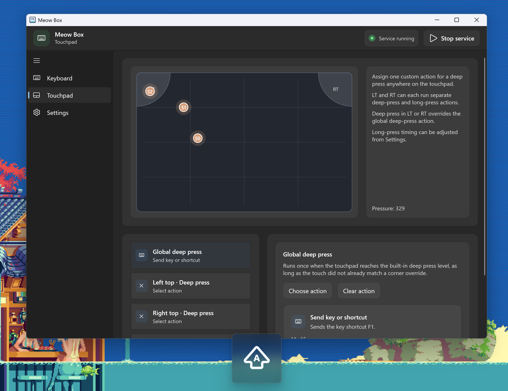
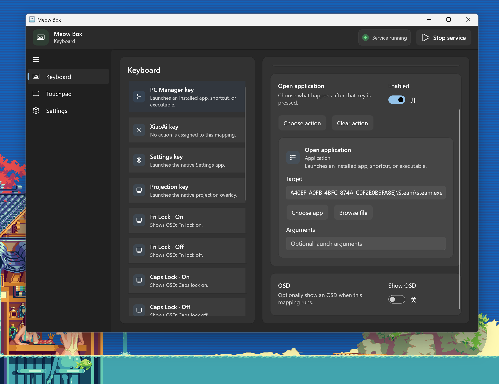

# Meow Box

[中文说明](#中文说明) | [English](#english)





## 中文说明

### 🐾 项目介绍

Meow Box 是一个适用于 **Xiaomi Book Pro 14 2026** 的厂商按键和触控板动作自定义工具。它可以把原本由厂商预设的硬件行为，变成更容易调整的自定义动作，并且增加了触控板的角区和重按支持。

> 当前的代码是基于作者之前的项目 [`Fn Mapping Tool`](https://github.com/leehyukshuai/Fn-Mapping-Tool) 针对 `Xiaomi Book Pro 14 2026` 进行单独适配得到的，如果你的机型不符合，可以前往 [`Fn Mapping Tool`](https://github.com/leehyukshuai/Fn-Mapping-Tool) 来获取支持的版本。

### ✨ 更新状况

#### **v1.0.0**

- 触控板自定义动作，支持 **全局重按**、**左上角重按 / 长按**、**右上角重按 / 长按**
- 厂商按键自定义动作，可自定义 **小爱键、管家键、设置键、投屏键** 等 OEM 按键
- 发送标准按键的功能现在不仅支持发送单键，也支持发送 **组合键**
- 重绘了 **Caps Lock / Backlight / Microphone / Fn Lock** 的 OSD 显示，更美观克制
- 有更贴合这台机器的默认配置与界面流程，省去了预设和配置的操作
- 添加了随系统启动的选项，开机启动更加即时快速
- 支持 Portable 和 Msi 两种运行方式，可以从 [release 界面](https://github.com/leehyukshuai/Meow-Box/releases/tag/v1.0.0) 进行下载

### 🧩 项目说明

#### 📁 项目结构

- `src/MeowBox.Controller/` — WinUI 3 控制器
- `src/MeowBox.Worker/` — 后台 Worker
- `src/MeowBox.Core/` — 共享模型、服务、IPC
- `src/MeowBox.Setup/` — WiX 安装包工程
- `assets/` — 应用资源
- `build/` — 中间产物
- `artifacts/` — 最终发布产物

#### 🧱 运行时要求

默认构建产物是 **framework-dependent**，体积更小。

目标电脑如果没装运行时，需要先安装：

- **.NET 8 Desktop Runtime x64**
- **Windows App Runtime x64（建议 1.7 或更新）**

#### 🔨 构建

默认构建：

```powershell
.\build.ps1
```

可选参数：

- `-Version 1.0.0` — 指定输出版本号
- `-Zip` — 额外生成 Portable zip 包
- `-Msi` — 额外生成 MSI 安装包
- `-PackageAll` — 同时生成 zip 和 msi
- `-SelfContained` — 生成 self-contained 构建，体积更大

示例：

```powershell
.\build.ps1 -Version 1.0.0 -PackageAll
.\build.ps1 -Version 1.0.0 -Zip
.\build.ps1 -Version 1.0.0 -Msi
```

默认输出：

- `artifacts/MeowBox/`
- `artifacts/MeowBox-portable-v<version>.zip`
- `artifacts/MeowBox-setup-v<version>.msi`

### 🎨 版权相关

- 协议：**GPL-3.0**（见 `LICENSE`）
- 应用 icon 来源：
  - [https://www.flaticon.com](https://www.flaticon.com/)
- OSD 图标均为作者本人绘制

---

## English

### 🐾 Project introduction

Meow Box is a customization tool for **Xiaomi Book Pro 14 2026**, focused on OEM keys and touchpad actions. It turns vendor-defined hardware behavior into something easier to customize, and adds support for touchpad corner regions and deep press actions.

> The current codebase is a standalone adaptation of the author's previous project, [`Fn Mapping Tool`](https://github.com/leehyukshuai/Fn-Mapping-Tool), specifically tailored for `Xiaomi Book Pro 14 2026`. If your device does not match, you can use [`Fn Mapping Tool`](https://github.com/leehyukshuai/Fn-Mapping-Tool) for the supported version instead.

### ✨ Release status

#### **v1.0.0**

- Custom touchpad actions with **global deep press**, **left-top deep press / long press**, and **right-top deep press / long press**
- Custom OEM key actions for **XiaoAi key, Manager key, Settings key, Projection key**, and similar vendor keys
- Standard-key sending now supports both single keys and **key chords**
- Redesigned **Caps Lock / Backlight / Microphone / Fn Lock** OSD with a cleaner and more restrained look
- A default configuration and UI flow tailored to this device, without preset/model setup steps
- Added startup-with-Windows support for faster and earlier launch after sign-in
- Both Portable and MSI distributions are available on the [release page](https://github.com/leehyukshuai/Meow-Box/releases/tag/v1.0.0)

### 🧩 Project details

#### 📁 Project layout

- `src/MeowBox.Controller/` — WinUI 3 controller
- `src/MeowBox.Worker/` — background worker
- `src/MeowBox.Core/` — shared models, services, IPC
- `src/MeowBox.Setup/` — WiX installer project
- `assets/` — application assets
- `build/` — intermediate outputs
- `artifacts/` — final distributables

#### 🧱 Runtime requirements

The default build output is **framework-dependent**, which keeps the package smaller.

If the target PC does not already have the required runtime installed, add these first:

- **.NET 8 Desktop Runtime x64**
- **Windows App Runtime x64 (1.7 or newer recommended)**

#### 🔨 Build

Default build:

```powershell
.\build.ps1
```

Optional arguments:

- `-Version 1.0.0` — sets the output version
- `-Zip` — also builds a Portable zip
- `-Msi` — also builds an MSI installer
- `-PackageAll` — builds both zip and msi
- `-SelfContained` — builds a self-contained package with larger size

Examples:

```powershell
.\build.ps1 -Version 1.0.0 -PackageAll
.\build.ps1 -Version 1.0.0 -Zip
.\build.ps1 -Version 1.0.0 -Msi
```

Default outputs:

- `artifacts/MeowBox/`
- `artifacts/MeowBox-portable-v<version>.zip`
- `artifacts/MeowBox-setup-v<version>.msi`

### 🎨 Copyright

- License: **GPL-3.0** (see `LICENSE`)
- Application icon attribution:
  - [https://www.flaticon.com](https://www.flaticon.com/)
- All OSD icons are drawn by the author
